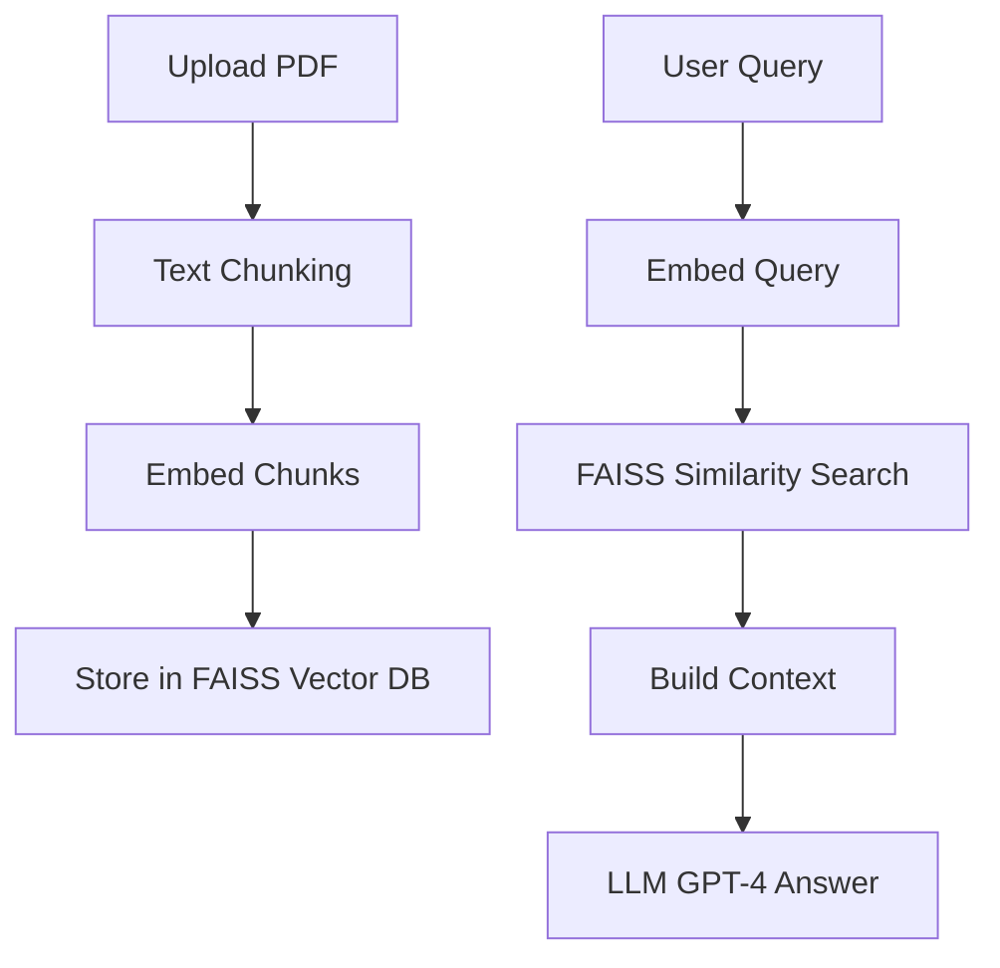

# 🧠 RAG-Based Q&A System with FastAPI

A **Retrieval-Augmented Generation (RAG)** powered chatbot that answers domain-specific questions from custom documents such as legal contracts or company policies. It uses **HuggingFace embeddings**, **FAISS** as a vector store, and **OpenAI GPT-4** for answering queries.

---

## 📐 Architecture



---

## 💡 Features

- Upload and index your own documents (PDF)
- Embed content with `sentence-transformers`
- Store embeddings using FAISS
- Query with OpenAI's GPT-4 using top-k retrieved chunks
- Clean, modular FastAPI backend

---

## 📁 Project Structure

```
rag_qa_app/
├── app/
│   ├── main.py              # FastAPI entry point
│   ├── rag.py               # RAG logic (query + context)
│   ├── vector_store.py      # Embeddings and FAISS logic
│   ├── document_loader.py   # Load + split PDF text
│   └── config.py            # Configs (API keys, paths)
├── uploaded_docs/           # Uploaded files (auto-created)
├── vector_store/            # FAISS index (auto-created)
├── requirements.txt
└── .env
```

---

## ⚙️ Setup

### 1. Clone the Repository

```bash
git clone https://github.com/yourusername/rag-qa-fastapi.git
cd rag-qa-fastapi
```

### 2. Install Dependencies

```bash
pip install -r requirements.txt
```

### 3. Add `.env` File

Create a `.env` file in the root folder:

```env
OPENAI_API_KEY=your_openai_key_here
```

---

## 🚀 Running the App

```bash
uvicorn app.main:app --reload
```

---

## 📋 API Usage

### 🔼 Upload a Document

**Endpoint:**
```
POST /upload
```

**Form Data:**
- `file`: The PDF document to ingest

**Example using `curl`:**
```bash
curl -X POST http://localhost:8000/upload   -F "file=@your_document.pdf"
```

---

### ❓ Ask a Question

**Endpoint:**
```
POST /ask
```

**Form Data:**
- `question`: Your query about the uploaded document

**Example using `curl`:**
```bash
curl -X POST http://localhost:8000/ask   -F "question=What is the termination clause?"
```

---

## 🧠 Technologies Used

- [FastAPI](https://fastapi.tiangolo.com/)
- [LangChain](https://python.langchain.com/)
- [HuggingFace Transformers](https://huggingface.co/)
- [FAISS](https://github.com/facebookresearch/faiss)
- [OpenAI GPT-4](https://platform.openai.com/)
- [pdfplumber](https://github.com/jsvine/pdfplumber)

---

## 🔒 Notes

- Currently supports one active document at a time (extendable to multi-doc setup)
- Use domain-specific embedding models (e.g., LegalBERT) for better accuracy
- You can replace OpenAI with local LLMs via vLLM or Llama.cpp

---

## 📦 To-Do / Improvements

- [ ] Multi-document support with metadata filters
- [ ] Web frontend (Streamlit or React)
- [ ] Chunking by semantic units (headings, paragraphs)
- [ ] Reranking + hallucination mitigation


